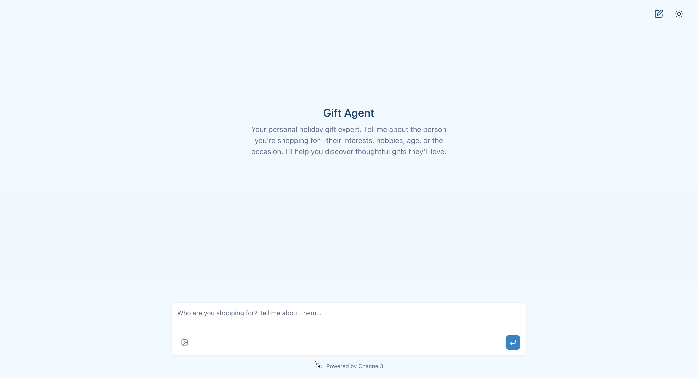
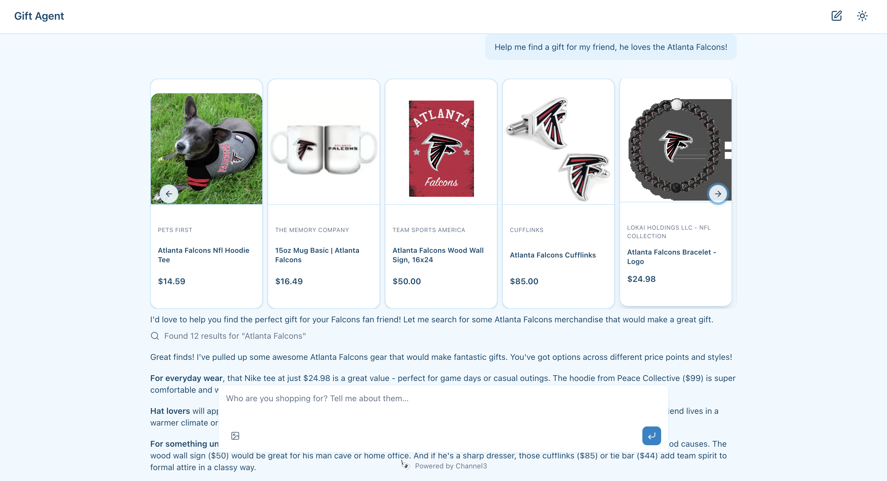
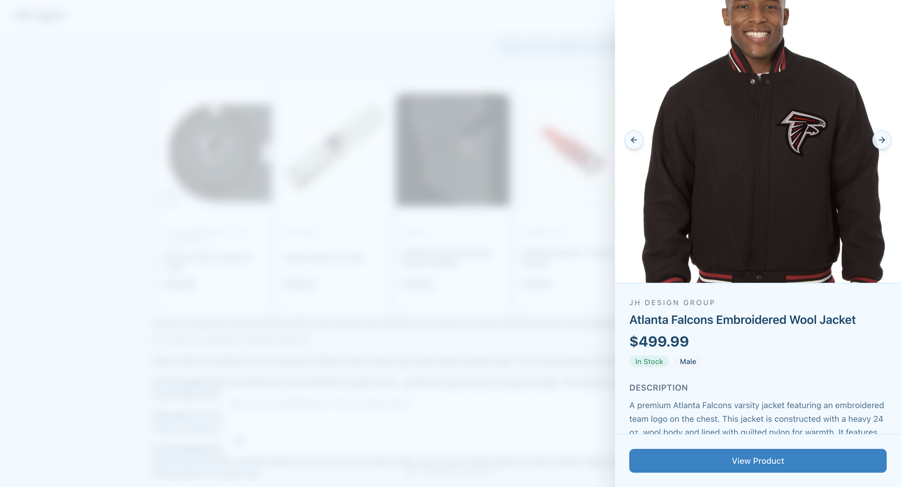

# Shopping Assistant with Channel3

A simple AI chatbot built with Next.js and the Vercel AI SDK that uses [Channel3](https://trychannel3.com) for real-time product search. Ask about products in natural language, and the bot will search Channel3's catalog and display results in an interactive carousel.



**Key Features:**
- 🛍️ Natural language product search powered by Channel3
- 💰 **Built-in monetization** - Channel3 handles affiliate tracking and revenue sharing automatically
- 💬 Streaming chat responses using AI SDK 6 (beta)
- 🎨 Beautiful UI with AI Elements and shadcn/ui components
- ⚡ Fast Edge runtime for low-latency responses

## Images

### Product Search Results
Ask about any product and see results displayed in an interactive carousel:



### Product Details
Click any product to view detailed information, pricing, variants, and more:



## Prerequisites

- **Node.js 18.18+** (required for Next.js 16)
- **[pnpm](https://pnpm.io/)** (or npm/yarn)
- **API Keys:**
  - [Channel3 API key](https://trychannel3.com) for product search
  - [Vercel AI Gateway API key](https://vercel.com/d?to=%2F%5Bteam%5D%2F%7E%2Fai&title=Go+to+AI+Gateway) (or use BYOK with your own provider keys)

## Quick Start

### 1. Install Dependencies

```bash
pnpm install
```

### 2. Configure Environment Variables

Copy `.env.example` to `.env.local`:

```bash
cp .env.example .env.local
```

Then add your API keys:

| Variable               | Required | Description                                                                    |
| ---------------------- | -------- | ------------------------------------------------------------------------------ |
| `CHANNEL3_API_KEY`     | ✅       | Your Channel3 API key ([get one here](https://trychannel3.com))              |
| `AI_GATEWAY_API_KEY`   | ✅       | Vercel AI Gateway API key ([get started](https://vercel.com/d?to=%2F%5Bteam%5D%2F%7E%2Fai&title=Go+to+AI+Gateway)) |

**Advanced:** For alternative authentication methods like [BYOK](https://vercel.com/docs/ai-gateway/byok) or [OIDC tokens](https://vercel.com/docs/ai-gateway/authentication), see the [AI Gateway docs](https://vercel.com/docs/ai-gateway).

### 3. Configure Your App

Customize everything in one place: `app/app-config.ts`:

```typescript
export const appConfig = {
  // 1. Choose your model (using AI Gateway provider/model format):
  model: 'anthropic/claude-3-5-sonnet-20241022',
  // 2. Customize metadata, UI text, and agent behavior:
  metadata: {
    title: 'Your App Title',
    description: 'Your app description',
  },
  ui: {
    emptyState: {
      title: 'Your Agent Name',
      description: 'Your welcome message...',
    },
    input: {
      placeholder: 'Your input placeholder...',
    },
  },
  agent: {
    instructions: 'Your agent personality and instructions...',
  },
  // 3. Add Channel3 search filters (optional):
  search: {
    filters: {
      availability: ['InStock', 'PreOrder'],
      // price: { min_price: 20, max_price: 100 },
      // gender: 'unisex',
    },
  },
};
```

This app uses [Vercel AI Gateway](https://vercel.com/docs/ai-gateway) for unified access to all AI providers with built-in monitoring, budgets, and fallbacks.

### 4. Start the Development Server

```bash
pnpm dev
```

Open [http://localhost:3000](http://localhost:3000) and start chatting!

## How It Works

The chatbot is built around a few key files:

- **`app/app-config.ts`** - Single configuration file for LLM provider, agent behavior, UI text, and search filters
- **`agent/tools/channel3.ts`** - Defines the `searchProducts` tool that queries Channel3's API
- **`agent/chat-agent.ts`** - Creates a `ToolLoopAgent` that uses the searchProducts tool
- **`agent/system-prompt.ts`** - System instructions that guide the AI's behavior
- **`app/api/chat/route.ts`** - API route that handles chat requests and streams responses
- **`app/page.tsx`** - Main UI that renders the chat interface with product carousels

When a user asks about products, the AI agent automatically calls the `searchProducts` tool, which queries Channel3. Results are displayed in an interactive carousel above the AI's response.

### Image Search

Users can upload images to search for similar products. Due to a limitation in the AI SDK where large tool parameters (like base64 images) get truncated, we use a pointer-based workaround:

1. Image data is stored server-side with a unique ID (`lib/image-attachments.ts`)
2. The agent receives a short pointer string (e.g., `"image:abc123"`)
3. The tool resolves the pointer back to the full base64 data

This pattern is encapsulated in `lib/image-attachments.ts` and can be reused for any tool that needs to handle large data payloads. For more details, see the [AI SDK issue](https://github.com/vercel/ai/issues/10179).

### Monetization

Channel3 provides **built-in monetization** for your shopping assistant. When users click through to purchase products, Channel3 automatically:
- Tracks affiliate conversions using their integrated affiliate network
- Handles commission payouts directly to you
- Provides analytics on clicks, conversions, and revenue

No need to set up separate affiliate accounts or tracking pixels - it's all included with your Channel3 API key.

## Advanced Customization

### Channel3 Search Filters

You can add advanced filters to narrow down product search results in `app/app-config.ts`:

```typescript
search: {
  filters: {
    brand_ids: ['brand-123', 'brand-456'], // Limit to specific brands
    category_ids: ['category-789'], // Filter by categories
    gender: 'unisex', // 'male', 'female', or 'unisex'
    price: { min_price: 20, max_price: 100 }, // Price range
    availability: ['InStock', 'PreOrder'], // Stock status
    condition: 'new', // 'new', 'refurbished', or 'used'
    website_ids: ['website-456'], // Limit to specific retailers
    exclude_product_ids: ['prod-123'], // Exclude specific products
  },
}
```

See the [Channel3 API documentation](https://docs.trychannel3.com) for all available filters and options.

## Deployment

This app is optimized for deployment on [Vercel](https://vercel.com). See the [Next.js deployment documentation](https://vercel.com/docs/frameworks/full-stack/nextjs) for complete setup instructions.

When deploying, make sure to add your environment variables (`CHANNEL3_API_KEY`, `LLM_API_KEY`, `LLM_MODEL`) in your Vercel project settings.

## Learn More

- [Channel3 Documentation](https://docs.trychannel3.com)
- [Vercel AI SDK](https://ai-sdk.dev)
